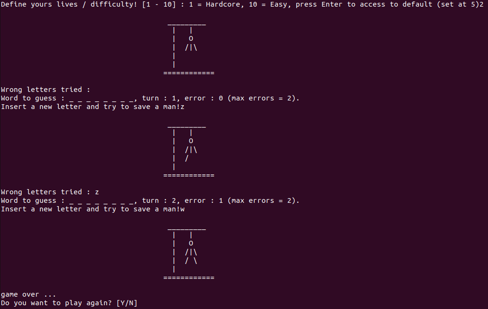

# Hangman
Learning Python OOP

## Description
The repository Hangman is a little project proposed by BeCode in order to understand and practice Python Object-Oriented Programming.
The project is built arround two files :
- The game.py file which contains all the Hangman's class attributes and functions (constructor included)
- The main.py file which contains the script necessary to create and execute an instance of the the Hangman's class (game session)

## Installation
Download the repository on your computer without modify the repository structure and files locations, then, 
you can launch the game in your terminal (from the folder repository location) with the `python main.py` command 
(This require python installed on your machin).

## Usage
The Hangman game is a simple game where one or more players try to guess a word, each turn suggesting a letter.
Here the player will be invite to define the difficulty of the game, play the game, and confirm if he want to play more.

